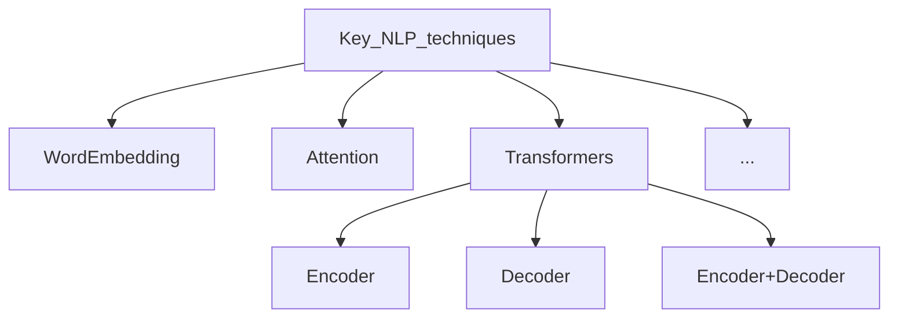
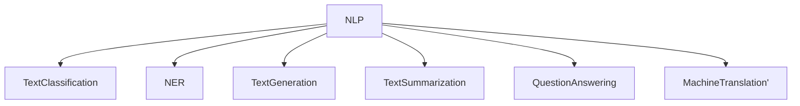

# nlp-core

This repo is to store various basic implementations for the most common NLP tasks and important techniques.

The most common NLP tasks in the industry for Artificial Intelligence presented below. Current state of the art for all tasks is based on transtormers models.

