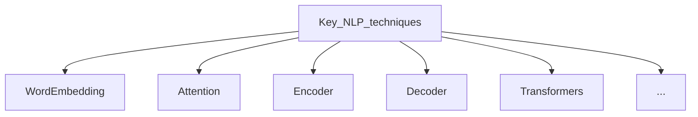
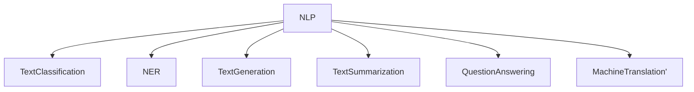

# nlp-core

This repo is to store various basic implementations for the most common NLP tasks and important techniques.

```mermaid
  graph TD;
  Key_NLP_techniques-->WordEmbedding;
  Key_NLP_techniques-->Attention;
  Key_NLP_techniques-->Encoder;
  Key_NLP_techniques-->Decoder;
  Key_NLP_techniques-->Transformers;
  Key_NLP_techniques-->...;
```

~The most common NLP tasks

```mermaid
  graph TD;
  NLP-->TextClassification;
  NLP-->NER;
  NLP-->TextGeneration;
  NLP-->TextSummarization;
  NLP-->QuestionAnswering;
  NLP-->MachineTranslation';
```

