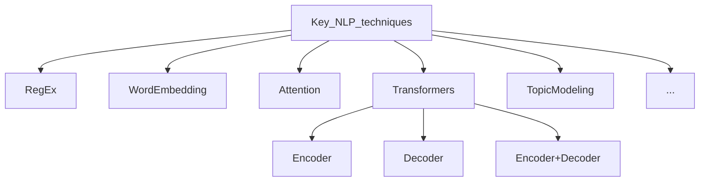
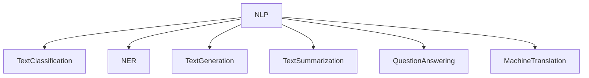

# nlp-core

This repo is to store various basic implementations for the most common NLP tasks and important techniques.

The most common NLP tasks in the industry for Artificial Intelligence presented below. Current state of the art for the tasks listed below is based on transtormer architecture models.

In some cases NLP task can be tackled in a cheaper way than training a model. For example, to extract specific pattern from texts could work rule-based approach and handy Spacy library features.

Also Text clustering cannot be resolved with transformers but unsupervised probabilistic approach as Topic Modelling could help.

